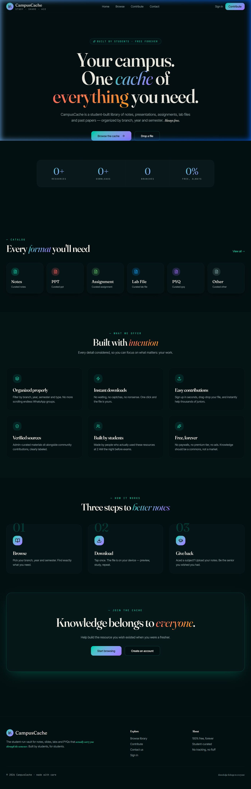
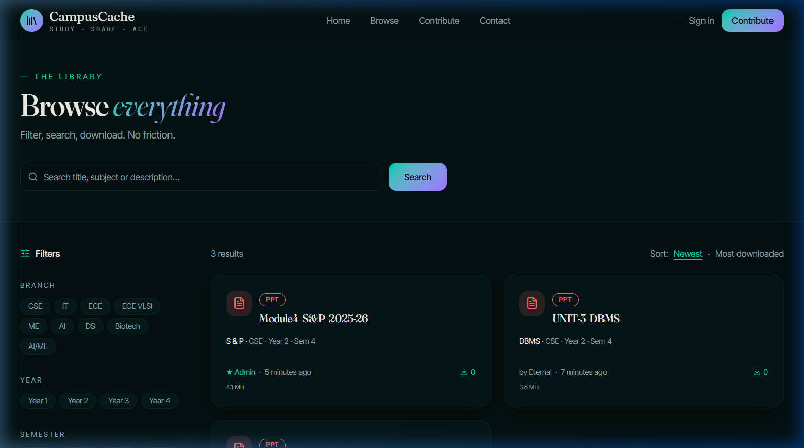
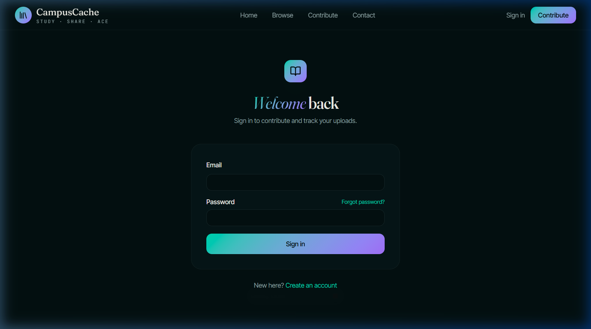
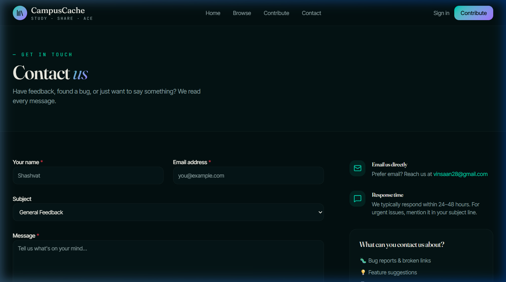

<div align="center">


# CampusCache

### *The student-run vault for notes, slides, labs & PYQs*

[](https://campus-cache.vercel.app)
[](https://tanstack.com/start)
[](https://supabase.com)
[](https://vercel.com)
[](https://tailwindcss.com)
[](LICENSE)

<br/>

> **Browse · Download · Contribute** — Free college study materials, organized by branch, year & semester.

</div>

---

## 📸 Screenshots

<div align="center">

### 🏠 Home Page


### 📚 Browse Library


### 🔐 Sign In / Sign Up


### 📬 Contact Us


</div>

---

## ✨ Features

| Feature | Description |
|---|---|
| 📚 **Resource Library** | Browse thousands of notes, PPTs, lab files & PYQs |
| 🔍 **Smart Filtering** | Filter by branch, year, semester, subject, file type |
| ⬇️ **Instant Download** | Files save directly to your device — no redirects |
| 👁️ **In-browser Preview** | PDFs render inline; other files open cleanly |
| 📤 **Contribute** | Upload your own materials with a guided form |
| 🔐 **Auth** | Sign up / sign in with email (Supabase Auth) |
| 🛡️ **Admin Panel** | Admins can delete & manage all resources |
| 📬 **Contact Form** | Users can send feedback & queries by email |
| 🌑 **Dark Mode** | Elegant dark theme with custom OKLCH color palette |
| ⚡ **SSR** | Server-side rendered with TanStack Start on Vercel |

---

## 🖥️ Tech Stack

```
Frontend     TanStack Start (React SSR) · TanStack Router · React 19
Styling      Tailwind CSS v4 · tw-animate-css · Custom design system
UI Library   Radix UI primitives · shadcn/ui components
Backend      Supabase (PostgreSQL + Storage + Auth + RLS)
Email        EmailJS (contact form delivery)
Build        Vite 7 · @vitejs/plugin-react · @tailwindcss/vite
Deployment   Vercel (SSR via serverless functions)
Language     TypeScript 5
```

---

## 📁 Project Structure

```
campus-connect-hub/
├── api/
│   └── index.js              # Vercel SSR serverless function
├── src/
│   ├── components/
│   │   ├── Header.tsx        # Sticky nav with auth dropdown
│   │   ├── Footer.tsx        # Site footer with links
│   │   ├── CountUp.tsx       # Animated number counter
│   │   └── ui/               # shadcn/ui component library
│   ├── routes/
│   │   ├── __root.tsx        # Root layout (head, shell, providers)
│   │   ├── index.tsx         # Landing page
│   │   ├── browse.tsx        # Resource library with filters
│   │   ├── resource.$id.tsx  # Resource detail + download/open
│   │   ├── contribute.tsx    # Upload a new resource
│   │   ├── contact.tsx       # Contact / feedback form
│   │   ├── auth.tsx          # Sign in / sign up
│   │   ├── profile.tsx       # User profile
│   │   └── admin.tsx         # Admin dashboard
│   ├── integrations/
│   │   └── supabase/         # Supabase client, types, auth middleware
│   ├── lib/
│   │   ├── auth.tsx          # AuthProvider + useAuth hook
│   │   ├── constants.ts      # Branches, years, file types, formatters
│   │   └── resources.ts      # attachUploaderProfiles helper
│   ├── hooks/                # Custom React hooks
│   ├── router.tsx            # TanStack Router config
│   └── styles.css            # Global styles + Tailwind theme tokens
├── supabase/                 # Supabase migrations & seed data
├── vercel.json               # Vercel deployment config
├── vite.config.ts            # Vite + TanStack Start + Tailwind config
└── .env.example              # Environment variable template
```

---

## 🚀 Getting Started

### Prerequisites

- **Node.js** ≥ 18
- **npm** ≥ 9
- A free [Supabase](https://supabase.com) account
- A free [EmailJS](https://www.emailjs.com) account *(for contact form)*

### 1. Clone the repository

```bash
git clone https://github.com/imshashvat/CampusCache.git
cd CampusCache
```

### 2. Install dependencies

```bash
npm install
```

### 3. Set up environment variables

```bash
cp .env.example .env
```

Edit `.env` and fill in your credentials:

```env
# Supabase
VITE_SUPABASE_URL=https://your-project.supabase.co
VITE_SUPABASE_PUBLISHABLE_KEY=your-anon-key
SUPABASE_URL=https://your-project.supabase.co
SUPABASE_PUBLISHABLE_KEY=your-anon-key

# EmailJS (for contact form)
VITE_EMAILJS_SERVICE_ID=service_xxxxxxx
VITE_EMAILJS_TEMPLATE_ID=template_xxxxxxx
VITE_EMAILJS_PUBLIC_KEY=xxxxxxxxxxxxxxx
```

### 4. Set up Supabase

1. Create a new project at [supabase.com](https://supabase.com)
2. Run the migrations in `supabase/` via the SQL editor or Supabase CLI
3. Create a **Storage bucket** named `resources` (public read access)
4. Enable **Row Level Security** policies for your tables

### 5. Set up EmailJS *(optional — contact form)*

1. Create a free account at [emailjs.com](https://www.emailjs.com)
2. Add a **Gmail service** → copy the Service ID
3. Create an **email template** with variables: `user_name`, `user_email`, `subject`, `message`, `reply_to`
4. Copy your **Public Key** from Account settings
5. Add all three values to your `.env`

### 6. Run locally

```bash
npm run dev
```

Open [http://localhost:8080](http://localhost:8080) in your browser.

---

## 🌐 Deployment (Vercel)

This project is pre-configured for Vercel deployment.

1. Push your code to GitHub
2. Import the repo at [vercel.com/new](https://vercel.com/new)
3. Add your environment variables in **Project Settings → Environment Variables**:
   - All `VITE_SUPABASE_*` and `SUPABASE_*` keys
   - All `VITE_EMAILJS_*` keys
4. Deploy — Vercel will run `npm run build` automatically

> The `vercel.json` routes all requests through the TanStack Start SSR function while serving static assets from `dist/client/`.

---

## 📜 Available Scripts

| Command | Description |
|---|---|
| `npm run dev` | Start local dev server (HMR enabled) |
| `npm run build` | Build for production |
| `npm run preview` | Preview the production build locally |
| `npm run lint` | Run ESLint |
| `npm run format` | Format code with Prettier |

---

## 🗄️ Database Schema

The app uses these main Supabase tables:

```sql
-- Resources (study materials)
resources (
  id uuid PRIMARY KEY,
  title text NOT NULL,
  description text,
  file_type text,          -- 'notes' | 'ppt' | 'lab' | 'pyq' | 'assignment' | 'other'
  branch text NOT NULL,
  year int NOT NULL,
  semester int NOT NULL,
  subject text,
  file_path text NOT NULL, -- Supabase Storage path
  file_size bigint,
  uploaded_by uuid REFERENCES auth.users,
  is_admin_upload boolean DEFAULT false,
  is_featured boolean DEFAULT false,
  download_count int DEFAULT 0,
  created_at timestamptz DEFAULT now()
)

-- User profiles
profiles (
  id uuid PRIMARY KEY REFERENCES auth.users,
  full_name text,
  is_admin boolean DEFAULT false,
  created_at timestamptz DEFAULT now()
)
```

---

## 🤝 Contributing

Contributions are welcome! Here's how to get involved:

1. **Fork** the repository
2. Create a feature branch: `git checkout -b feat/your-feature`
3. Make your changes with clear commit messages
4. Open a **Pull Request** describing what you changed and why

### Contribution ideas

- 🌙 Light mode / theme toggle
- 🔔 Notifications for new uploads in your branch
- ⭐ Bookmarks / favourites system
- 🏷️ Tag-based search
- 📊 Upload analytics for contributors

---

## 📬 Contact

Have feedback or questions? Use the **[Contact page](https://campus-cache.vercel.app/contact)** on the site or email directly:

**[vinsaan28@gmail.com](mailto:vinsaan28@gmail.com)**

---

## 📄 License

This project is open source under the [MIT License](LICENSE).

---

<div align="center">

Made with ☕ and care by students, for students.

**[CampusCache](https://campus-cache.vercel.app)** — *knowledge belongs to everyone*

</div>
